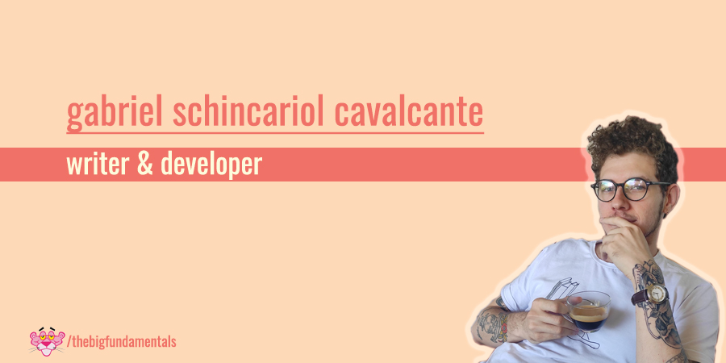

### Hey there!

#### Who am I?

I am **Gabriel Schincariol Cavalcante**, born in Boituva, a small city in the state of São Paulo. At 17 I went to the Air Force Cadets School, where I started to write more frequently as a way to face the strict military routine. I graduated from **Law School at the University of São Paulo** (#1 in Brazil and South America, #46 World Wide). However, I am not a lawyer, but a **writer**. In 2021 my first book was published, Um mundo em que existem baleias (A World With Whales), by Patuá, an indie publisher. At the moment, besides writing fiction and non-fiction, I've been studying web development, as a way to put together my writing and creative skills with tech tools.

- 🌱 I've gone through some cool courses, such as **The Web Developer Bootcamp**, by Colt Steele, and **JavaScript Ninja**, by Fernando Daciuk
- 🔭 Right now, I'm studying React on **The Modern React Bootcamp**
- ⚡ What can I do? I can do **creative writing, content writing, copywriting** - heck, anything with writing! You can check my [Medium](https://gschincariol.medium.com) to see what I am up to. Now I am also mastering my skills in web development 🤓
- 🗣 I am from Brazil, so I am a native Portuguese speaker, but I am also fluent in English
- ⛹️‍♀️ thebigfundamentals is my nickname because I am a San Antonio Spurs fan and Tim Duncan Is The Goat! (if you didn't know TD is called [The Big Fundamental](https://bleacherreport.com/articles/1670561-how-tim-ducan-got-and-earned-his-nickname-the-big-fundamental), now you know)

Get in touch with me on [LinkedIn](https://www.linkedin.com/in/gschincariol/?locale=en_US), or [Twitter](https://twitter.com/tbfundamentals), or wherever you want.

Cheers!

<!--
**thebigfundamentals/thebigfundamentals** is a ✨ _special_ ✨ repository because its `README.md` (this file) appears on your GitHub profile.

Here are some ideas to get you started:

- 🔭 I’m currently working on ...
- 🌱 I’m currently learning ...
- 👯 I’m looking to collaborate on ...
- 🤔 I’m looking for help with ...
- 💬 Ask me about ...
- 📫 How to reach me: ...
- 😄 Pronouns: ...
- ⚡ Fun fact: ...
-->
